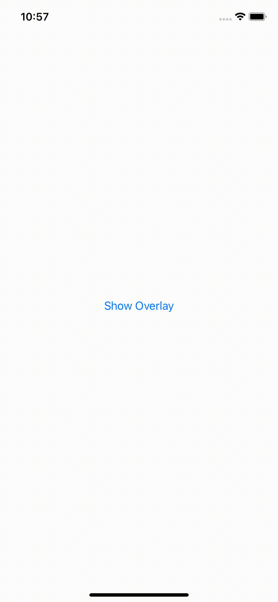

# ZStack Animation Issues SwiftUI

## Specs

- Xcode 12.5.1
- iOS 14.5

## Problem

I want to animate zIndex 0 of the ZStack via `.opacity` transition and the rest of the ZStacks children via `.move(...)`. This can not be achieved with this project.

## Gifs

